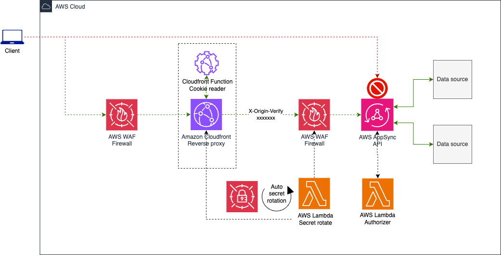
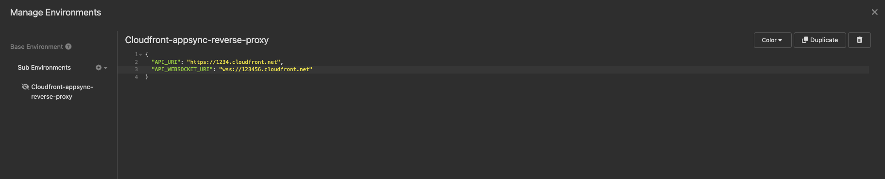
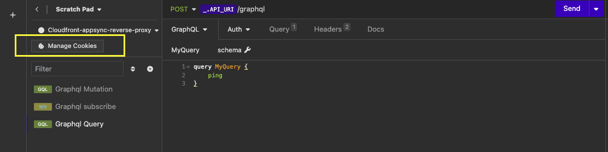
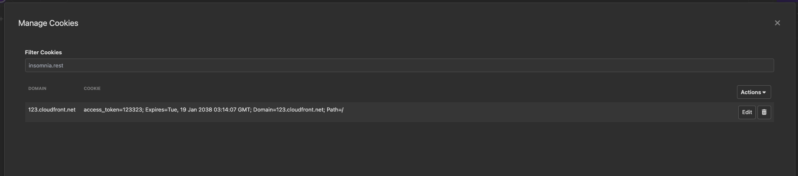
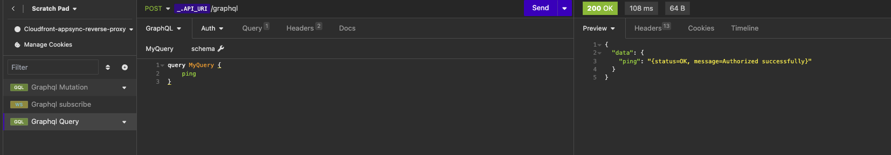

# Passing Cookies with CloudFront as a Reverse Proxy to AWS AppSync API

## Overview

The code demonstrates how CloudFront can be used as reverse proxy for cookie based authorization. By leveraging this approach, cookies are read from the headers and passed as Authorization headers to AWS AppSync, effectively offloading the responsibility from the frontend and ensuring a secure communication process.

## Before you start
1. The AWS Lambda authorization implementation serves as an illustrative example and is not suitable for production workloads. Instead, it's advisable to validate tokens against the identity provider.
2. The solution does not work with websockets, API key can be used for websockets.
3. The AWS AppSync origin is secured by forwarding the X-Origin-Verify header from Amazon CloudFront to the Web Application Firewall (WAF) on the AWS AppSync side. More details on this pattern can be found here: https://aws.amazon.com/blogs/security/how-to-enhance-amazon-cloudfront-origin-security-with-aws-waf-and-aws-secrets-manager/

## Getting started

1. Download and install terraform. Details can be found here -> https://developer.hashicorp.com/terraform/tutorials/aws-get-started/install-cli
2. Download and install tflint for terraform code style & syntax issues. Details can be found here -> https://github.com/terraform-linters/tflint
3. Install checkov to scan for vulnerabilities -> https://www.checkov.io/2.Basics/Installing%20Checkov.html
4. Install Insomnia client to test the deployed API. The insomnia test collection is present in the /app folder and can be used to test the setup. URLs have to be updaed in the collection based on URLs of the deployed resources in your environment. i.e. Amzazon Cloudfront distribution URL, AWS AppSync API URL. Insomnia client download -> https://insomnia.rest/download

## Application deployment

1. Add your AWS credentials in the terminal. `export AWS_PROFILE=<You profile>`. More details can be found here -> https://docs.aws.amazon.com/cli/latest/userguide/cli-configure-files.html
2. After installing all the prerequisite, go to /infrastructure folder.
`cd infrastructure`
3. Run `terraform init` to initialize /install all terraform modules.
4. Run `terraform plan` to review the resources that will be provisioned.
5. Run `terraform apply` to deploy the infrastructure in the target account (Account for which you added your credentials in the terminal).

## Test

1. After the infrastructure is provisioned, go to `cd /docs` folder and import insomnia collection in the insomnia client. 
2. Copy Cloudfront distribution URL and AppSync API URL.
3. Update the environment in insomnia with the copied URls.

    
4. Click on manage cookies to set cookies on the Cloudfront distribution domain.

    

    Set cookie

    
6. Start testing the Queries, Mutations and Subscriptions.

    
